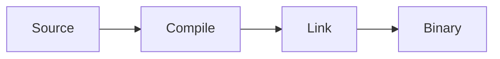

# ~/qizi706 博客写作指南

这个博客使用 Astro Content Collections 管理文章。所有文章都放在：

```text
src/content/blog/
```

文件名会成为文章地址。例如：

```text
src/content/blog/linux-process.md
                    ↓
/blog/linux-process/
```

## 快速开始

复制下面的模板，新建 `src/content/blog/文章名.md`：

```md
---
title: '文章标题'
description: '一两句话概括文章内容，用于文章列表和 SEO。'
pubDate: '2026-08-06T12:00:00+08:00'
categories:
  - 'OS'
tags:
  - 'Linux'
  - 'Kernel'
draft: true
mathjax: false
mermaid: false
---

这里写开场介绍。

## 第一节

这里写正文。

## 第二节

继续写正文。
```

建议在写作期间保持 `draft: true`，完成后改成 `false`。草稿不会出现在文章列表中，也不会生成公开文章页面。

## Frontmatter 字段

每篇文章开头的 `---` 区域是 Frontmatter：

| 字段          | 必填 | 说明                                      |
| ------------- | :--: | ----------------------------------------- |
| `title`       |  是  | 文章标题                                  |
| `description` |  是  | 文章摘要，用于列表和页面元数据            |
| `pubDate`     |  是  | 发布时间，建议使用带 `+08:00` 的 ISO 时间 |
| `updatedDate` |  否  | 最后更新时间，格式与 `pubDate` 相同       |
| `categories`  |  否  | 分类数组，会生成可筛选的分类归档          |
| `tags`        |  否  | 标签数组                                  |
| `draft`       |  否  | 默认 `false`；设为 `true` 时不发布        |
| `mathjax`     |  否  | 文章使用数学公式时设为 `true`             |
| `mermaid`     |  否  | 文章使用 Mermaid 图表时设为 `true`        |
| `heroImage`   |  否  | 文章头图，必须引用 `src` 中的本地图片     |

分类和标签必须写成 YAML 数组，即使只有一个值：

```yaml
categories:
  - 'C/C++'
tags:
  - 'C++ 特性'
```

头图示例（路径相对于当前文章）：

```yaml
heroImage: '../../assets/blog-placeholder-1.jpg'
```

## Markdown 正文

文章支持标准 Markdown：

```md
## 二级标题

普通段落包含 **粗体**、_斜体_、`inline code` 和 [链接](https://example.com)。

- 无序列表
- 第二项

1. 有序列表
2. 第二项

> 普通引用内容
```

文章总标题已经由 Frontmatter 中的 `title` 生成，所以正文建议从 `##` 开始，不要重复写 `# 文章标题`。

### 代码块

在代码围栏后写语言名称即可启用语法高亮：

````md
```cpp
#include <iostream>

int main() {
    std::cout << "hello, world\n";
}
```
````

常见语言名称包括 `cpp`、`c`、`rust`、`go`、`python`、`javascript`、`typescript`、`bash`、`lua` 和 `text`。代码字体统一使用 Fira Mono。

### 图片

文章图片建议放在 `public/assets/` 的独立目录中：

```text
public/assets/linux-process/process-tree.png
```

然后在文章中从网站根目录引用：

```md

```

图片会保持原始比例显示，不带黑框、圆角或阴影。请填写有意义的替代文本，方便无障碍阅读，也便于图片加载失败时辨认内容。

### 提示块

支持以下五种提示块：`NOTE`、`TIP`、`IMPORTANT`、`WARNING`、`CAUTION`。

```md
> [!NOTE]
> 这里是一条补充说明。

> [!WARNING]
> 这里说明一个容易踩坑的地方。
```

### 数学公式

使用公式时，将 Frontmatter 中的 `mathjax` 设为 `true`：

```md
行内公式：$E = mc^2$

块级公式：

$$
T(n) = O(n \log n)
$$
```

公式实际由 KaTeX 在构建时渲染；`mathjax` 字段用于标记这篇文章包含数学内容。

### Mermaid 图表

使用 Mermaid 时，将 `mermaid` 设为 `true`：

````md

````

`mermaid: true` 很重要，它会让文章页面加载 Mermaid 渲染器。

## 使用 SlideCard

`SlideCard` 是项目内置的文章卡片组件。使用组件的文章必须采用 `.mdx` 后缀：

```text
src/content/blog/course-notes.mdx
```

在 MDX 中可以直接使用组件，不需要手动 `import`：

````mdx
<SlideCard title="进程与线程">

## 进程是什么？

- 进程拥有独立地址空间
- 线程共享进程资源

```cpp
std::thread worker(task);
worker.join();
```

</SlideCard>
````

使用时注意：

- `<SlideCard>` 与正文之间保留空行，Markdown 才能稳定解析。
- `title` 是卡片顶部标题，可以省略。
- 一个组件只生成一张卡片；需要多张时写多个 `<SlideCard>`。
- 普通 `#` 标题不会自动生成卡片。
- `.md` 适合普通文章；需要 `SlideCard` 等组件时才使用 `.mdx`。

## 本地预览

首次拉取项目后安装依赖：

```sh
npm install
```

按项目约定，以后台模式启动开发服务器：

```sh
astro dev --background
```

默认访问地址为 `http://localhost:4321`。管理后台服务器：

```sh
astro dev status
astro dev logs
astro dev stop
```

如果系统没有全局 `astro` 命令，可以通过项目依赖执行同样的命令：

```sh
npm run astro -- dev --background
npm run astro -- dev status
npm run astro -- dev logs
npm run astro -- dev stop
```

## 发布前检查

完成文章后：

1. 将 `draft` 改为 `false`。
2. 检查标题、摘要、分类、标签和图片替代文本。
3. 如果用了公式或 Mermaid，确认对应开关为 `true`。
4. 运行类型与内容检查：

   ```sh
   npm exec astro check
   ```

5. 执行生产构建：

   ```sh
   npm run build
   ```

构建后的静态网站位于 `dist/`。

## 常见问题

### 为什么文章没有出现在列表里？

检查 `draft` 是否仍为 `true`，并确认 Frontmatter 字段通过了 `npm exec astro check`。

### 为什么 SlideCard 是空的？

确认文件后缀是 `.mdx`，组件开始和结束标签之间有空行，并且闭合标签拼写为 `</SlideCard>`。

### Markdown 和 MDX 应该选哪个？

- 只写文字、图片、代码、公式或 Mermaid：使用 `.md`。
- 需要在正文中使用 `SlideCard` 等 Astro 组件：使用 `.mdx`。

MDX 包含 Markdown 的主要写法，但同时会解析 JSX/组件语法，因此正文中的 `<`、`>` 和 `{}` 需要更加谨慎。

## 相关文档

- [Astro Content Collections](https://docs.astro.build/en/guides/content-collections/)
- [Astro Markdown](https://docs.astro.build/en/guides/markdown-content/)
- [Astro MDX](https://docs.astro.build/en/guides/integrations-guide/mdx/)
