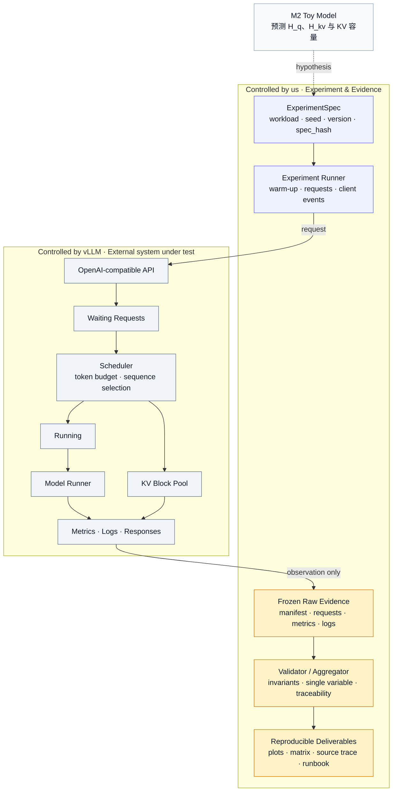
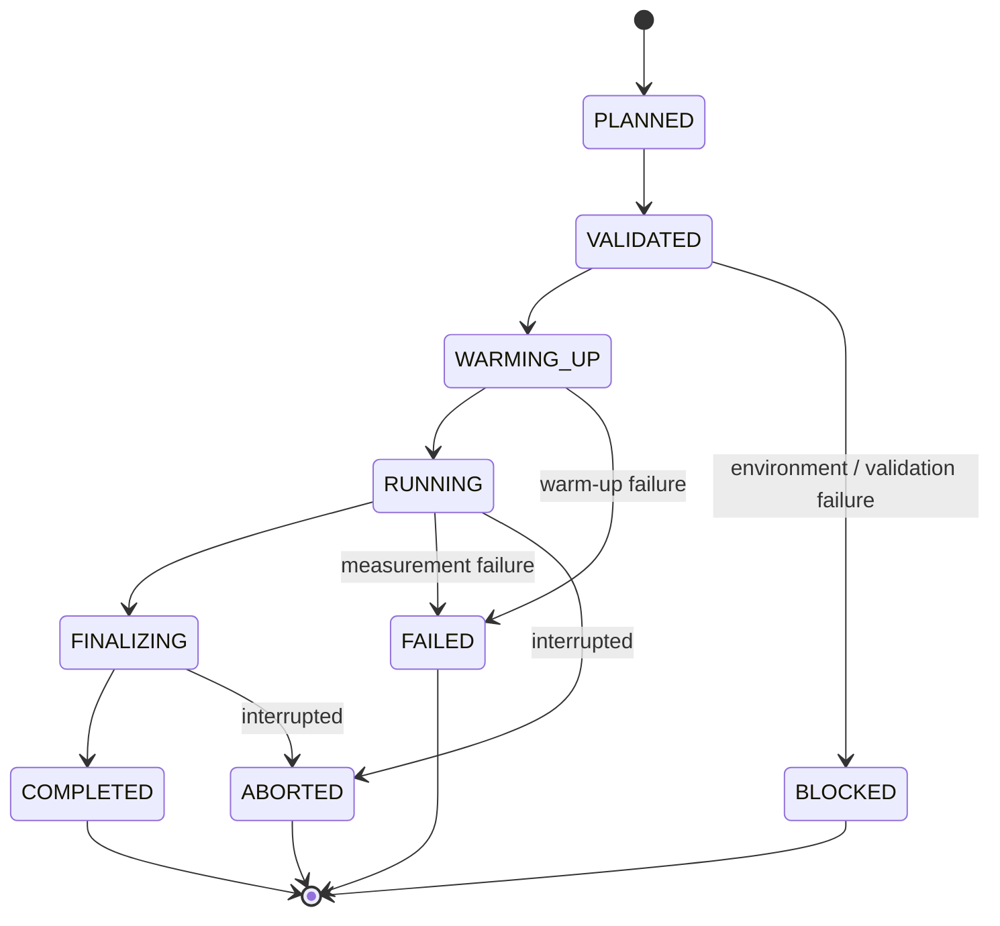
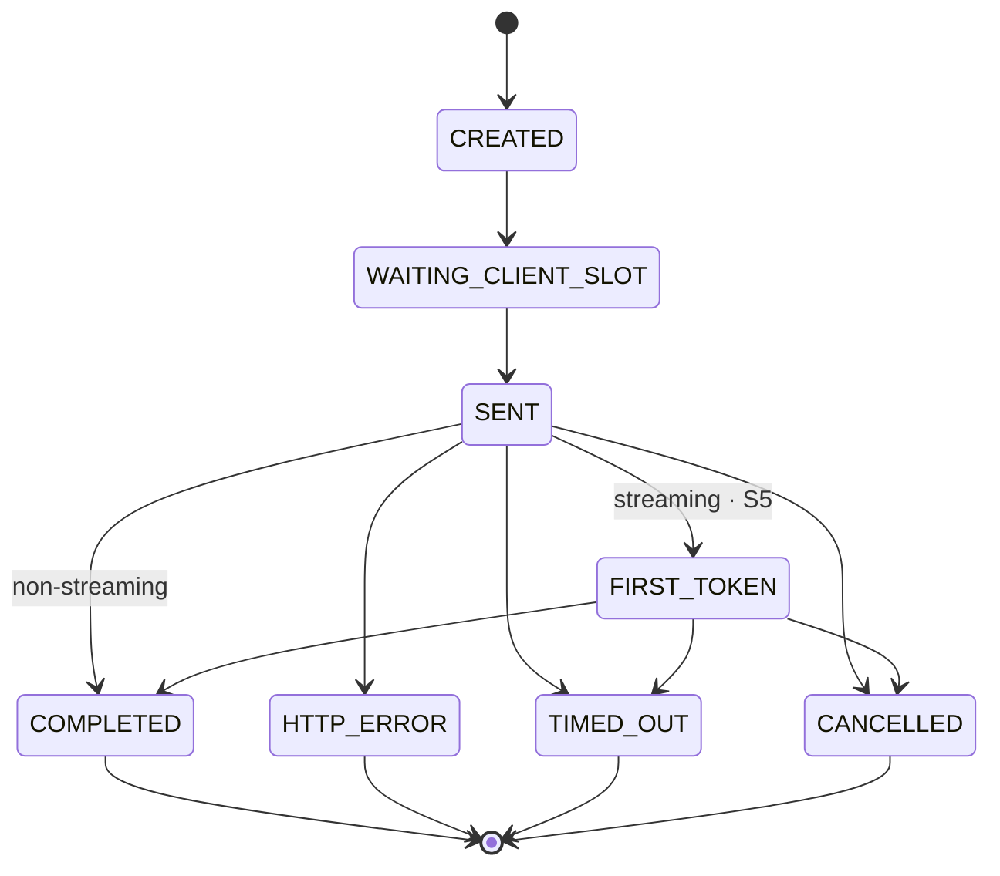
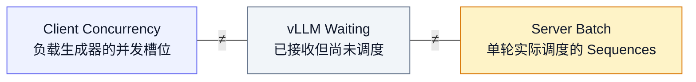
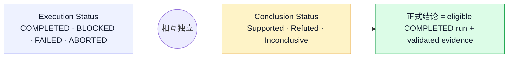

import ArticleImage from '../../components/ArticleImage.astro';

## 1. Aside：我连续两次把问题答小了

我最初把目标写成“独立写出脚手架”，后来又改成“从空文件完成一个程序”。两句话都没有错；可它们回答的只是：**代码怎样出现？**

真正困扰我的问题更大：现实里没有需求文档、目录树和标准答案，只有一个含糊的问题。我能不能自己找到使用者和约束，作出取舍，让第一条请求跑起来，再把状态、并发、失败、观测和交付接上，直到另一个人可以接手？

这次改题本身就是第一课：目标边界一旦写错，后面的代码越整齐，偏得反而越远。

<ArticleImage
	src="/assets/build-a-complete-system-from-scratch/m2-to-serving-evidence.webp"
	alt="学习者从 MHA 与 GQA 的 KV 容量模型出发，构建真实 vLLM Serving 实验并整理指标、源码和复现证据"
	width="100%"
	maxWidth="100%"
	loading="eager"
	caption="本文的贯穿案例：M2 机制模型 → S0–S6 Serving 实验 → R0 源码因果 → F0 复现交付。"
/>

## 2. (Why) 空仓库里的第一行，真的是代码吗？

<SlideCard title="Quiz: 现在，请从一无所有构建一个系统">

# 你会先写什么？

## 看起来都很合理

- `main.py`
- 一棵漂亮的目录树
- API Interface 和一排 `TODO`
- Dockerfile、CI、Metrics……工程感拉满

## 但我们还不知道

- 谁会使用它？
- 它替谁承担什么责任？
- 什么现象出现，才算问题被解决？
- 哪些失败必须处理？哪些保证第一版明确没有？

> 所以第一行通常不是代码，而是一条可以被反驳的系统承诺。

</SlideCard>

“从零开始”很容易被理解成把一个空文件逐行写长。这个动作能解释程序怎样出现，却不能解释系统怎样出现。

系统真正面对的是另一种空白：问题尚未形式化，组件彼此依赖，状态会并发变化，外部世界一定失败，资源永远有限，最后还得部署、复现和交接。AI 可以一口气生成二十个文件，但目录只是决定留下的形状，不是决定本身。

目录树长得像一家大公司的组织架构，也不妨碍它一条真实请求都接不住。

## 3. (What) “完整”到底是什么意思？

先把三个经常混用的词拆开：

| 层次           | 形成的闭环                                 | 仍未回答的问题                     |
| -------------- | ------------------------------------------ | ---------------------------------- |
| 完整程序       | 输入、计算、输出、错误                     | 多组件状态、外部依赖、运行生命周期 |
| 完整系统       | 请求、状态、资源、失败、观测、部署与恢复   | 企业级规模、合规与组织约束         |
| 大规模生产平台 | 高可用、多租户、安全、合规、跨节点持续演进 | 超出本文范围                       |

本文讨论第二层。单机系统可以完整，全球平台也可能不完整。区别不在机器数量，而在它有没有诚实地声明边界，并在边界内形成闭环。

> #### 🔑 第一把钥匙：完整 = 有边界的承诺
>
> 系统不需要承诺一切；它需要说清楚承诺什么、怎样证明，以及暂时不保证什么。

> #### 🔑 第二把钥匙：系统 = 对象 + 状态机 + 可观察的因果链
>
> 谁拥有状态？状态如何变化？资源何时获得和释放？失败后留下什么？如果这些问题没有答案，再多 Class 也只是比较精致的 Demo。

<SlideCard title="三个闭环，而不是很多文件">

# 请求闭环

- 一个真实调用方只能从公开边界进入
- 请求至少穿过一个会失败的真实依赖
- 成功、拒绝、超时和取消都有定义

# 状态闭环

- 每份状态和资源都有唯一 Owner
- 容量有上限
- 并发、崩溃与恢复行为可以重复

# 证据闭环

- 日志、指标或 Trace 能还原一次请求
- 构建、启动、停止和复现可以照文档完成
- 结论能回到原始记录，而不是只剩一张图

</SlideCard>

“独立构建”也不等于闭卷。可以查文档、用框架、复用数据库和推理引擎，也可以让 AI 生成机械代码。不能外包的是问题定义、状态模型、失败策略、验收标准和最终取舍——因为出问题时，系统不会接受“这是模板生成的”作为解释。

## 4. (How) 让一条真实请求把系统拽出来

### 4.1 写代码以前：先写一张系统承诺

假设我在本机运行 Load Generator 和模型 Backend。十个调用方都认为“提交成功”等于“最终会执行”，但 GPU 只能稳定承受两个活动请求。

第十一个请求怎么办？进程退出怎么办？调用方重复提交怎么办？

如果现在直接写 FastAPI，这些问题不会消失，只会藏进 Handler。第一张纸应该是一个短小的 System Contract：

<CodeCard title="System Contract" path="docs/system-contract.md">

```text
Problem / Users:
  谁遇到了什么问题？谁调用、运行和维护系统？

Promise / Non-goals:
  当前版本承诺哪些端到端行为？明确不提供什么？

External interface:
  请求、响应、错误与兼容边界是什么？

Lifecycle / Ownership:
  Run 与 Request 有哪些状态？谁修改每份状态、占有每份资源？

Invariants / Capacity:
  什么永远不能发生？队列、并发、内存和等待上限是多少？

Failure / Recovery:
  超时、取消、过载、崩溃和重启分别怎样处理？

Observability / Acceptance:
  怎样还原一条请求？哪些测试、原始数据和复现演练证明完成？
```

</CodeCard>

Contract 不是瀑布式终稿。实验可以推翻它，但修改时必须回答：哪个观察推翻了旧假设？哪些模块、测试和运行承诺跟着变化？

### 4.2 贯穿案例：不要在 vLLM 前面再造一个 vLLM

本文不另起一个“练手项目”。贯穿全文的系统，就是当前阶段 2 主线：从 M2 的 MHA/GQA 与 KV 容量模型出发，进入 S0–S6 的真实 vLLM Serving 实验，最后完成 R0 源码追踪与 F0 复现交付。

现有 [`benchmark_ollama_input_length.py`](/labs/serving-baseline/scripts/benchmark_ollama_input_length.py) 已经贯通了第一条窄路径：Warm-up、构造 Prompt、发送 HTTP 请求、记录 Backend 与 Client 时间、保存逐请求 CSV、聚合结果。

但它还不是新的 Serving 实验系统：

- 旧环境快照不能代表 S0 的当前环境；
- S1 需要三轮独立稳态基线和逐请求详情；
- S3 需要并发事件与服务端 Waiting/Running 证据；
- S5 需要真实流式 Chunk 时间戳，非流式脚本无法提供 ITL；
- R0/F0 还要把实测现象连到固定版本源码和复现包。

<SlideCard title="Quiz: 要不要先造一个 Job Gateway？">

# 看起来很“系统”

- `/v1/jobs`
- 自己的 Queue、Admission、Worker Pool
- 自己的 Scheduler 和 Metrics

# 实际上会挡住学习对象

- 外层 Worker 可能让 S3 的并发根本到不了 vLLM
- Gateway Queue Wait 会和 vLLM Waiting 混在一起
- S4 的 Scheduler Budget 可能永远没有被触及
- Job Polling 也不会自动产生 S5 所需的 Chunk 时间戳

> 当前任务是观察、解释并验证真实 vLLM，不是先写第二套调度器把它藏起来。

</SlideCard>

因此，我们只拥有实验规格、负载生成、客户端事件、证据采集、验证、聚合和复现；vLLM 继续拥有 Admission、Waiting/Running、Scheduler Budget、KV Block 和模型执行。



_Observation 不等于 Control。看到一个指标，不等于拥有它背后的状态。_

第一版也明确延后：自定义 Job API、持久队列、幂等重试、多 Backend Adapter、优先级调度、Kubernetes、多租户和公网部署。它们可能是 F0 之后的迁移项目，却不该抢走 M2 → S0–S6 → R0 的注意力。

### 4.3 系统里有什么对象？先画状态机

一个 Experiment Run 是一次不可变的实验尝试。开始测量后，Workload、模型、Backend 版本和 Server Config 不能原地修改；变量变了，就创建新的 `run_id`。



无论终态如何，已经追加的 Raw Data 都保留。`ABORTED` 不是“垃圾数据”的别名；它是系统在诚实描述现场。

Request 是另一个对象。它可能还在等客户端并发槽位，也可能已经发给 vLLM；两者不能都叫“排队”。



<SlideCard title="Quiz: Client Concurrency 等于 Server Batch 吗？">

# 不等于

- Client Concurrency
  - 负载生成器允许同时发出的请求数
- vLLM Waiting / Running
  - 服务端拥有的请求状态
- Server Batch
  - Scheduler 在 Token Budget、KV 容量和请求阶段下形成的结果

> Client Concurrency 是实验输入；Server Batch 是需要被观察的结果。

</SlideCard>



状态所有权必须写死：

| 事实                              | 唯一 Owner                   | 观察方式                       |
| --------------------------------- | ---------------------------- | ------------------------------ |
| ExperimentSpec、Run 状态          | Experiment Runner / Manifest | 原子写 Manifest，配置带 Hash   |
| Client Slot 与请求事件            | Async Workload Runner        | 单调时钟与 `requests.jsonl`    |
| Waiting/Running、Scheduler Budget | 真实 vLLM                    | `/metrics`、日志、固定版本源码 |
| KV Block 与 Prefix Hit            | 真实 vLLM                    | S0 确认后的 Metrics / Log      |
| 汇总与图表                        | Validator / Aggregator       | 只读取冻结的 Raw Artifact      |

还有一组经常被混写的状态：运行完成，不代表结论成立。



一个 `COMPLETED` Run 仍然可能得到 `Inconclusive`：参数被接受但没有生效、负载没有触及限制、服务端状态不可观测，都足以让因果判断停下来。

### 4.4 先走通一条窄路，再让模块生长

第一条 Walking Slice 只需要：冻结配置 → 发出一条真实请求 → 保存原始事件 → 读回并验证 → 复现同一结果。

它暂时不需要通用插件系统、任务平台或漂亮 Dashboard。每增加一个 Gate，再让新的压力催生一个职责：

| 主线压力                             | 新责任                      | 这时才出现的产物                        |
| ------------------------------------ | --------------------------- | --------------------------------------- |
| M2 需要证明 Head Axis 与容量         | 机制 Oracle                 | `multi_head.py`、元素映射测试、容量 CSV |
| S0 发现 Backend 能力可能漂移         | Capability Probe            | 版本、Help、启动日志、Capability Matrix |
| S1 的汇总必须追到每个请求            | Raw Writer 与 Validator     | 三轮详细结果、Metrics 快照              |
| S3 需要制造并发而不伪装 Server Batch | Async Workload Runner       | 请求事件、Client Slot 时间              |
| S5 需要 TTFT / ITL                   | Streaming Parser            | 首 Token 与逐 Token JSONL               |
| R0/F0 需要解释和交接                 | Source Trace / Reproduction | 固定版本调用链、复现包                  |

<CodeCard title="F0 以后可能留下的形状" path="public/labs/kv-cache-batch/">

```text
kv-cache-batch/
├── src/kv_cache_batch/
│   ├── attention.py
│   └── multi_head.py             # M2 到来时出现
├── tests/
├── docs/
│   ├── LEARNING_PLAN.md
│   └── M2_NOTES.md
├── tools/serving/                # 只在对应 Gate 到来时生长
│   ├── stream_harness.py         # S5
│   ├── validate_run.py
│   └── aggregate.py
└── results/serving/
    ├── raw/
    ├── metrics/
    ├── processed/
    ├── source-trace.md
    └── reproduction.md
```

</CodeCard>

目录是系统决策留下的化石，不是第一天应该膜拜的蓝图。一个文件如果不能对应当前 Gate 的 Question、Artifact 或 Acceptance，就先别创建。

## 5. (How) 用 Gate 构建，而不是用功能列表堆积

现有 [`LEARNING_PLAN.md`](/labs/kv-cache-batch/view/docs/LEARNING_PLAN.md/) 已经给出了顺序，不需要再发明第二张路线图：

```text
M2
 -> S0 -> S1 -> S2 -> S3 -> S4 -> S5 -> S6
 -> R0 -> F0
```

把原计划折叠成七个系统 Gate：

| Gate               | 回答的问题                             | 通过证据                                 |
| ------------------ | -------------------------------------- | ---------------------------------------- |
| M2 资源模型        | 每个 Sequence 携带多少 KV 状态？       | Oracle、Shape、Head 隔离、容量 CSV       |
| S0 运行边界        | 当前 Backend 到底支持并暴露什么？      | 环境、Help、启动日志、Capability Matrix  |
| S1 Walking Slice   | 一条真实请求能否留下可重建证据？       | 三轮逐请求结果、Metrics 快照、可重建汇总 |
| S2–S3 Workload     | 长度与客户端并发怎样触发饱和？         | 单变量曲线、请求事件、服务端状态         |
| S4 Scheduler       | 预算是否生效并真正被工作负载触及？     | 两组独立扫描、启动与运行证据             |
| S5–S6 Stream/Reuse | TTFT、ITL 与 Prefix Reuse 怎样被观测？ | Chunk 时间线、Prefix Hit、三次复现       |
| R0–F0 因果与交付   | 现象为何发生，别人能否复现？           | 固定版本 Source Trace、异常记录、复现包  |

### 5.1 参数生效，需要连续四次确认

<SlideCard title="Quiz: CLI 接受参数，等于 Backend 支持吗？">

# 不等于

1. Argument accepted
2. Startup log confirmed
3. Metric / state visible
4. Workload actually exercised

任一环缺失，都不能把“没有变化”解释成“参数没用”。它也许被忽略了，也许负载没有触及上限，也许 KV 容量先成为瓶颈，也许变化落在没有采集的状态里。

> 这时最准确的结论不是成功或失败，而是 `Unsupported`、`Unobservable` 或 `Inconclusive`。

</SlideCard>

### 5.2 失败不是边角料，是系统输入

| Failure              | Run behavior     | 必须保留的证据                 | 结论边界                    |
| -------------------- | ---------------- | ------------------------------ | --------------------------- |
| 缺少 Metrics / 参数  | `BLOCKED`        | Help、错误、Capability         | 依赖能力不继续扫描          |
| HTTP Error / Timeout | 继续或按阈值失败 | 原样写入 `requests.jsonl`      | 不删除以美化成功率          |
| Output 提前停止      | 正常记录         | Actual tokens、Stop reason     | 不用配置上限冒充工作量      |
| Metrics 采样空洞     | 标记受影响区间   | 采样时间与错误                 | 服务端因果为 `Inconclusive` |
| Streaming 解析失败   | 请求进入错误终态 | 已到达 Chunk 与异常            | 不伪造 ITL                  |
| vLLM 退出 / 实验中断 | `ABORTED`        | Manifest、Raw Data、Server Log | 复跑必须使用新 `run_id`     |

<CodeCard title="每个 Run 的最小证据契约" path="results/serving/<run-id>/">

```text
manifest.json
  run_id, spec_hash, environment, versions, model_revision,
  server_command, workload, start_ns, end_ns, run_state

requests.jsonl
  request_id, arrival_ns, waiting_client_slot_ns, sent_ns,
  first_token_ns?, token_times_ns?, finish_ns,
  input_tokens, output_tokens, status, error_type, stop_reason

metrics.jsonl
  sampled_at_ns, running_requests, waiting_requests,
  kv_usage?, prefix_hits?, backend_metric_names

server.log
  startup, capability confirmation, request and failure context
```

</CodeCard>

`first_token_ns` 和 `token_times_ns` 到 S5 才是必需字段；S1–S4 的非流式记录不能拿 Submit ACK 冒充 TTFT。Metrics 后的 `?` 也不是偷懒：S0 没证明可观测的字段，就必须显式写 `Unobservable`。

### 5.3 一张图必须能走回原始现场

Validator 至少检查：

- 每个 `request_id` 唯一，时间戳单调；
- `created = completed + http_error + timed_out + cancelled`；
- 配置请求数与 Raw Row 数一致，或差异有明确记录；
- 一组对照只改变一个主变量；
- P50/P95/P99、吞吐和曲线点都能由 Raw Artifact 重建。

客户端可以证明 Arrival、Sent、First Token、Chunk、Finish、HTTP 状态和实际 Token 数，却不能独立证明请求为什么等待、KV Cache 是否命中或某轮 Batch 为何形成。服务端因果还需要 Metrics、Log、Trace 或固定版本源码。

<SlideCard title="Quiz: P95 上升了，可以怪 Scheduler 吗？">

# 客户端可以证明

- 某个 Workload 下端到端延迟或 ITL 变差

# 客户端不能独立证明

- 请求在 Scheduler 中等待了多久
- KV Cache 是否命中
- 某轮实际 Batch 怎样形成

# 所以还要对齐

- Request Event
- Server Metrics / Log
- 固定版本 Source Trace

</SlideCard>

## 6. (Debug) 卡住时，先定位自己在哪一层

“我不知道下一步写什么”至少有六种完全不同的原因：

<SlideCard title="System Debug Ladder">

1. **问题定义**
   - 使用者与成功场景仍然含糊
   - 补一个真实故事，不写代码
2. **系统边界**
   - 不知道本系统和依赖分别负责什么
   - 重写 Promise、Non-goals 与 External Contract
3. **状态所有权**
   - Run、Client Request 与 vLLM 状态混在一起
   - 画状态机，为每份事实指定 Owner
4. **请求路径**
   - Runner、Writer、Sampler 的记录无法对齐
   - 追踪一个 `run_id + request_id`
5. **能力与环境**
   - 参数、指标、端口或版本不确定
   - 回到 S0，用最小请求和 Capability Matrix 固定它
6. **证据与因果**
   - 系统能跑，但解释只是一个合理故事
   - 补原始事件、服务端观测与独立对照

</SlideCard>

求助时提交当前层的模型、原始证据和第一个错误假设，而不是一句“请重写整个系统”。好的帮助应该缩小搜索空间，不应该拿走系统所有权。

## 7. (Practice) 怎样让能力最后属于自己？

### 7.1 AI 应该站在反馈侧

<SlideCard title="AIGC Policy">

# ✅ 交给 AI

- 审查我先写出的 Contract 和状态机
- 构造能破坏不变量的并发交错
- 指出第一个缺少证据的因果判断
- 生成 Fixture、解析器和重复绘图代码

# ❌ 不外包

- 需求、责任边界与验收标准
- 一次生成完整目录和全部实现
- Tests Passed 后直接宣布系统完成
- 自己无法解释的状态、指标和结论

</SlideCard>

一个有效的协作顺序是：

1. 我先写 Contract、Prediction 和 Acceptance，AI 找反例。
2. 我贯通第一条真实请求，AI 帮我定位第一个错误假设。
3. 我完成失败、负载和证据闭环，AI 作为 Reviewer 提替代解释。
4. 我改变一个约束并独立演进系统，用迁移结果检查能力是否真的形成。

当我已经能审查字段、时间语义、不变量和原始结果时，AI 生成机械代码可以加速工作；不能解释和验证的生成结果，不属于我的系统能力。

### 7.2 三轮训练，而不是一次通关

#### 第一轮：在当前主线上完成系统

沿 M2 → S0–S6 → R0 → F0 前进。每个 Gate 都留下同一张学习卡：

```text
Question:    这次要消除哪个系统不确定性？
Prediction:  哪个判断可能是错的？
Action:      让哪条系统行为成立？
Artifact:    代码、测试、Trace、数据或 Runbook 在哪里？
Acceptance:  哪些现场现象证明通过？
Feedback:    谁或什么挑战了结论？
Reflection:  哪个模型失败？下一步因此怎样改变？
```

#### 第二轮：只改变一个现实条件

更换模型、Backend 或硬件中的一个。先预测哪些趋势应保持、哪些可能改变，再冻结新环境，复跑一组基线和压力实验。不要复制旧结论。

#### 第三轮：换系统，不复制目录

F0 与 Transfer Gate 通过后，再选择另一套系统。只带走 Contract、Walking Slice、State Ownership、Failure Matrix、Raw Evidence 和 Reproduction；如果仍能从现实问题推进到请求、状态、失败和交接，能力才完成迁移。

### 7.3 当前进度：不要把计划写成成绩

<Note title="当前唯一动作仍然是 M2-A1" class="title-underline">

仓库已经有 Attention、KV Cache、Batch 实现与 M1 的 240 条原始样本；P0 NumPy 语义验收也已完成。它们证明了机制实现与受控实验，不等于已经完成 Serving 系统。

当前 M2 仍是 `In progress`：先在 `multi_head.py` 中完成 `split_heads(projected, num_heads)`，用 Shape 与非零坐标元素映射证明 `[B, T, H × D_head] -> [B, H, T, D_head]`。M2 通过前不进入 S0；S0 通过前不开始性能扫描。S0–S6、R0 与 F0 都还是计划，不是本文已经取得的结果。

</Note>

## 8. 最终自测：作者离开以后，系统还存在吗？

把它当成一次毕业演示：另一名使用者只拿到仓库，在没有现场解释的情况下，他能否完成以下任务？

1. 按 Manifest 启动同版本 vLLM，并确认 Capability Matrix。
2. 从冻结的 ExperimentSpec 复跑一组 S1。
3. 把任意汇总值追到 `requests.jsonl` 的记录和公式。
4. 证明 S2/S3 的对照只改变一个主变量，并区分 Client 与 Server 状态。
5. 证明 S4 的负载确实触及 Scheduler Budget，而不是只改了 CLI。
6. 从 S5 的真实 Chunk 时间戳重建 TTFT 与 ITL。
7. 中断一次实验，确认 Raw Data 保留、Run 为 `ABORTED`、正式汇总没有生成。
8. 把一个已复现现象追到固定版本源码，再完成一次验证性复跑。

如果这些动作必须由作者在旁边“口头施法”，系统还没有完成；如果只能在原模型、原 Backend 和原机器上重复，能力也还没有完成迁移。

<Note title="Takeaways" class="title-underline">

- 完整不是功能多，而是在有限边界内履行了承诺。
- 第一行不是目录树，而是可反驳的系统承诺。
- 架构先写对象、状态、Owner 和数据方向，再写模块名。
- 失败与原始证据属于系统，不是写报告时才补的附件。
- 独立不是拒绝工具，而是能解释决定、复现失败，并在约束改变后重新建立闭环。

</Note>
