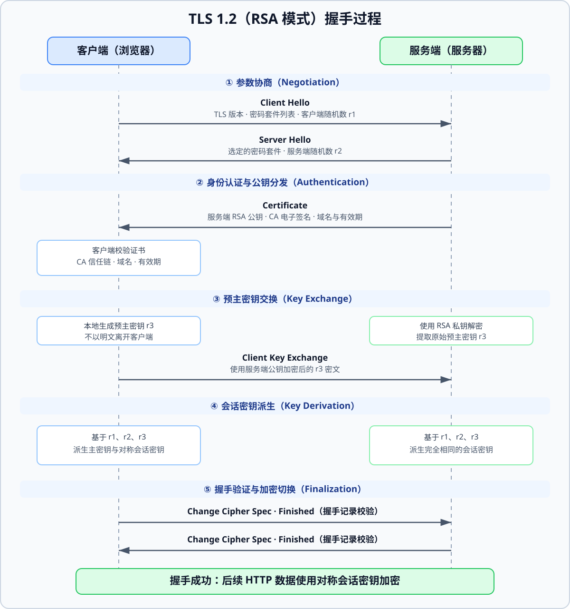

这是之前面试中遇到的问题，当时没有完全回答上来。这次重新整理时，我发现最容易混淆的是：证书认证、密钥交换和应用数据加密，分别在解决什么问题。

HTTPS 通过 TLS 为 HTTP 提供通道保护，主要目标是身份认证、机密性和完整性。攻击者仍可能截获网络数据包，但在证书验证正确、端点和密钥安全等前提下，不应能读出受保护的正文或悄悄篡改它。

## 1. 先限定本文的握手版本

下面的时序图使用 **TLS 1.2 的 RSA 密钥交换**作为历史教学示例。TLS 1.2 也支持 ECDHE 等密钥交换方式，不能把“客户端用证书公钥加密预主密钥”当成所有 HTTPS 连接的共同流程。TLS 1.3 已移除静态 RSA 密钥交换；本文第 3 节对照其变化。

## 2. TLS 1.2 RSA 握手拆解

### 2.1 Hello：协商参数

客户端通过 `ClientHello` 提交支持的版本、密码套件和客户端随机数 $r_1$；服务端通过 `ServerHello` 返回选定参数及服务端随机数 $r_2$。

在这里讨论的首次完整握手中，Hello 消息是明文。随机数需要参与后续密钥派生，但它们本身不承担保密责任。[RFC 5246 §6.1](https://www.rfc-editor.org/rfc/rfc5246#section-6.1) 规定初始记录层状态不启用加密或 MAC。

### 2.2 Certificate：验证公钥属于谁

服务端发送包含其公钥的证书及所需的中间证书。客户端验证证书链能否连接到本地信任的根证书，并检查域名、有效期和相关用途约束。服务器证书不一定由根 CA 直接签发。

这里建立的是“这个公钥可以代表我正在访问的服务器”的信任关系。证书和公钥可以公开；客户端不能因为收到了一个公钥就直接信任它。

### 2.3 ClientKeyExchange：传递预主密钥

在 RSA 密钥交换下，客户端生成预主密钥（Pre-master Secret，记作 $r_3$），用服务端证书中的 RSA 公钥加密，再通过 `ClientKeyExchange` 发送。服务端使用对应的私钥解密得到 $r_3$。

这个示例中，公钥加密保护的是预主密钥。此前的 Hello、证书等握手消息并没有全部经过非对称加密。[RFC 5246 §7.4.7.1](https://www.rfc-editor.org/rfc/rfc5246#section-7.4.7.1) 给出了 RSA 交换的具体结构。

### 2.4 密钥派生与 Finished：确认握手完整

双方使用预主密钥和握手随机数派生主密钥，再派生客户端、服务端各自的记录层密钥与所需参数。**主密钥不是直接拿来加密 HTTP 正文的密钥。**

在这个 TLS 1.2 流程中，双方分别发送 `ChangeCipherSpec` 切换记录层状态，再用新状态保护 `Finished`。接收方验证其中基于握手记录计算的校验值，确认密钥交换和握手内容没有发生可接受之外的变化；双方完成验证后才开始普通应用数据传输。具体消息顺序见 [RFC 5246 §7.3](https://www.rfc-editor.org/rfc/rfc5246#section-7.3)。

_TLS 1.2 RSA 首次完整握手示意，省略可选的客户端证书认证等消息。_

## 3. TLS 1.3 有什么不同？

以使用证书认证、没有 0-RTT 的 TLS 1.3 完整握手为例：

| 关注点         | TLS 1.2 RSA 示例                                | TLS 1.3 证书握手                                         |
| -------------- | ----------------------------------------------- | -------------------------------------------------------- |
| 密钥交换       | 客户端加密预主密钥，服务端用 RSA 私钥解密       | 通过临时 (EC)DHE 密钥交换建立共享秘密                    |
| 证书私钥的用途 | 在这个套件中用于 RSA 解密                       | 通过 `CertificateVerify` 签名证明身份；仍可使用 RSA 签名 |
| 握手消息保护   | 初始 Hello、证书等明文，切换状态后保护 Finished | `ServerHello` 之后的握手消息加密                         |
| 密钥派生       | 基于 PRF 派生主密钥及记录层密钥                 | 基于 HKDF 分阶段派生握手与应用流量密钥                   |

TLS 1.3 还有预共享密钥（PSK）和恢复连接的路径，不能用这一种完整握手覆盖所有情况。静态 RSA 交换被移除，也不等于 TLS 1.3 禁止 RSA 证书或 RSA 签名。上述差异对应 [RFC 8446 §1.2](https://www.rfc-editor.org/rfc/rfc8446#section-1.2) 和 [§2](https://www.rfc-editor.org/rfc/rfc8446#section-2)。

## 4. 截获公开参数，为什么仍不能解密正文？

我最初的疑问是：攻击者能看到两个随机数、证书和公钥，为什么不能自己算出密钥？

在 TLS 1.2 RSA 示例中，公开参数不足以恢复预主密钥。证书校验阻止攻击者随意替换成自己的公钥，Finished 验证再将协商内容与密钥绑定起来。机密性依赖秘密材料与密码学假设，认证和完整性也必须一同成立。

RSA 密钥交换本身不提供前向保密：如果服务端长期 RSA 私钥日后泄露，攻击者可能解开过去录制的密钥交换并恢复会话。TLS 1.3 的临时公钥交换路径改善了这一点，但它不能保护已经被控制的客户端或服务端。

还需要区分通道身份和业务身份。普通 HTTPS 通常认证服务器；任何客户端都可以尝试建立连接，具体用户权限由 Cookie、Session、Token 等应用机制决定。mTLS 可以增加客户端证书认证，业务授权仍由应用决定。

这次更正后的检查方法是：先确认 TLS 版本与密钥交换方式，再逐条标注哪些消息公开、哪一步验证身份、哪一步开始加密，以及哪些密钥必须保密。
